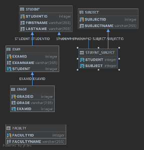

# Brightflag Code Test - Getting Started & Questions

### Notes:

Greetings Brightflag Software Engineer! 

Just to note, I had not previously used Spring Boot and had some difficulty mapping my objects to the database as I would have liked.    

I had intended to follow the Domain Driven Design (DDD) approach, as suggested here ['Spring Data JDBC, References, and Aggregates'](https://spring.io/blog/2018/09/24/spring-data-jdbc-references-and-aggregates), 
although this was not successful without using the Spring Data `CrudRepository` interface (which would have required a different architecture I believe).

The implementation could have been much better. Any feedback would be greatly appreciate!

*I have not added any dependencies.

The final h2 schema is below:

### Running the application
1. Run src/main/com/brightflag/codetest/Application.java as a Spring Boot app
2. Open [http://localhost:8080/](http://localhost:8080/)

## Application requirements
1. Students take multiple subjects and subjects have multiple students taking them
2. Students take multiple exams
3. Students receive grades for each of their exams
4. Add the functionality to the front-end to assign a student to a new subject
5. Create a unit test for Q4

### Extra information
1. Database schema: src/main/resources/schema.sql
2. Database data: src/main/resources/data.sql

